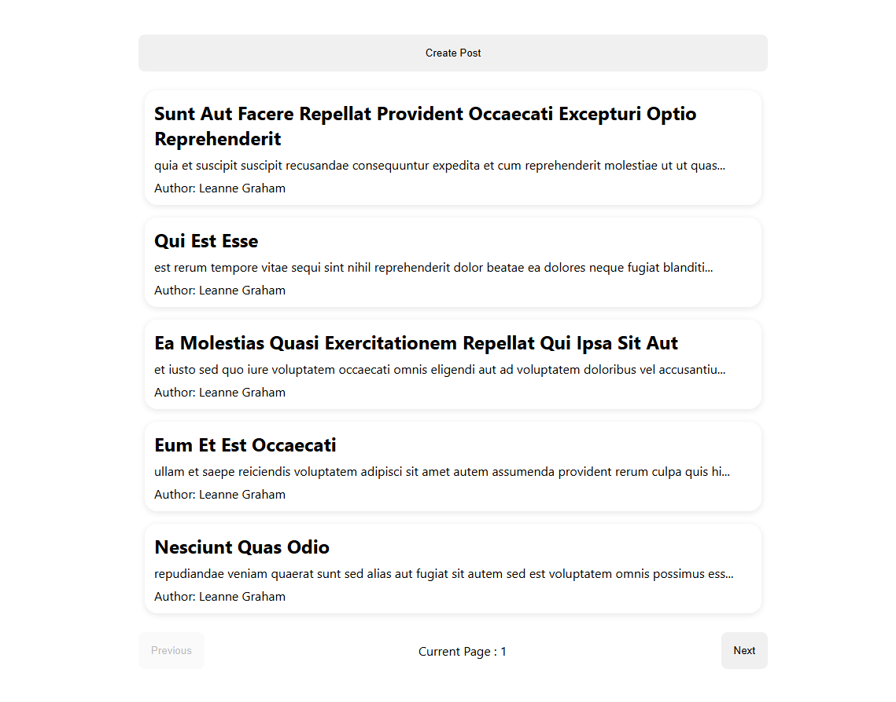
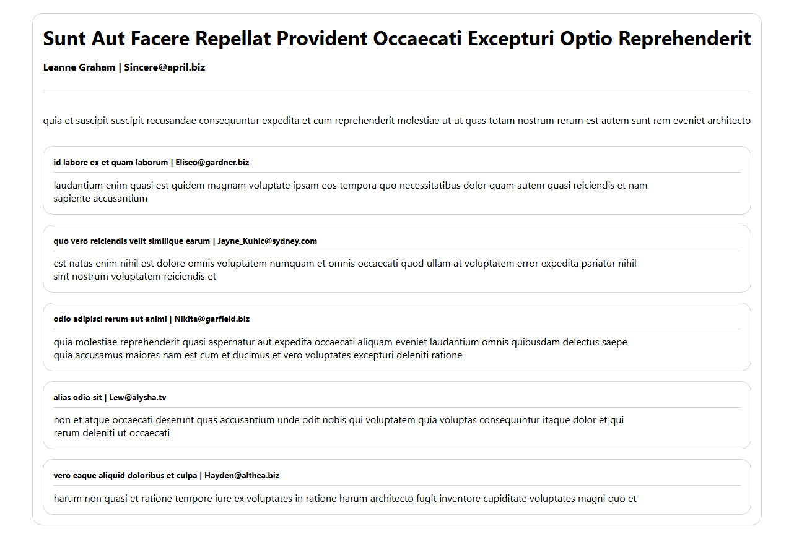

# 📝 GraphQL Posts Manager

A modern React application for managing blog posts with full Create operations, pagination, and real-time updates using GraphQL.

## 📸 Screenshots
### Home Page - Posts Listing


### Post Detail View


### Create Post Form


## 🛠 Tech Stack

### Core
- **React** with TypeScript
- **Create React App** 

### Data Layer
- **Apollo Client** - GraphQL client
- **GraphQL** - API communication

### Routing & UI
- **React Router DOM** - Client-side routing
- **Custom CSS** - No UI frameworks

### Development
- **TypeScript** - Type safety
- **ESLint** - Code quality

## 🚀 Getting Started

### Prerequisites

Before you begin, ensure you have the following installed:
- **Node.js** (v14.0.0 or higher)
- **npm** (v6.0.0 or higher)

You can verify your installations by running:
```bash
node --version
npm --version
```

### Installation

1. **Clone the repository**
   ```bash
   git clone https://github.com/AndyNusantara/kumparan-test-andy.git
   cd kumparan-test-andy
   ```

2. **Install dependencies**
   ```bash
   npm install
   ```
  
### Running the Application

Start the development server with:

```bash
npm start
```

The application will automatically open in your browser at [http://localhost:3000](http://localhost:3000)


## ⚠️ Implementation Notes

### API Constraint: User ID Field

**Issue:** The technical assessment requirements specified that the create post mutation field include `title`, `body`, and `userId`. However, the provided public GraphQL API only accepts `title` and `body` parameters.

**Solution Implemented:** The create post form includes a userId input field to match the requirements specification. The userId value is collected from the user but not sent to the API as it would cause the mutation to fail and only title and body are transmitted in the actual GraphQL mutation.


👤 Author
Andy Wijaya Nusantara
Created for: Kumparan Technical Assessment
